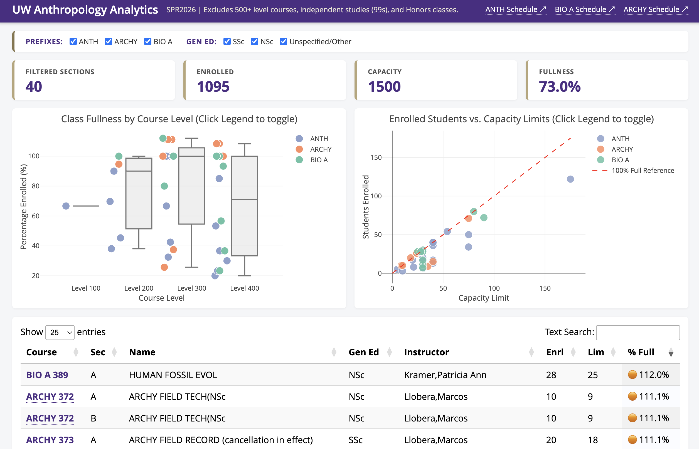

# Web Helpers for [UW Anthropology Department](https://anthropology.washington.edu/) Administrative Workflows

## Introduction

This repository contains scripts to create browser bookmarklets to help visualize and summarize data relating to day-to-day operations of the UW Anthropology Department. A [bookmarklet](https://en.wikipedia.org/wiki/Bookmarklet) is a bookmark stored in your web browser that contains JavaScript commands that make the browser do useful work. They only work on sites that require UW credentials to access. 

### A Note on Student Privacy and Data Security

**⚠️ Disclaimer & FERPA Warning**: These scripts are unofficial tools created to assist authorized UW faculty/staff workflows. These scripts access FERPA-protected education records. Use is restricted to authorized UW faculty/staff with legitimate educational interest. These scripts are not officially supported or endorsed by the University of Washington or the UW Department of Anthropology. Users of these tools are solely responsible for ensuring compliance with FERPA and [UW Data Security policies](https://it.uw.edu/policies/security-and-privacy-policies/uw-information-security-policies/). Authorised UW faculty/staff will always verify AI-generated outputs against official MyGrad records. AI output is not for official record-keeping; official MyGrad records always take precedence. No automated decisions are made about students using these tools.

**🔒 A Note on Student Privacy and AI**: Because this repository is public, students or parents may be reading this. Please be assured that student privacy is our highest priority:

-   No Public AI: These tools are strictly designed only to be used with UW's enterprise-secured instance of Microsoft Copilot.
-   No AI Training: Under [UW's commercial data protection agreement with Microsoft](https://itconnect.uw.edu/tools-services-support/software-computers/productivity-platforms/microsoft-productivity-platform/microsoft-copilot/), and [Microsoft's data privacy and security policy for Copilot](https://learn.microsoft.com/en-us/copilot/microsoft-365/microsoft-365-copilot-privacy) student data inputted into UW Copilot is never used to train Microsoft's public AI models.
-   Expert, Authorised Human Oversight: Generative AI is used strictly as a summarization and formatting aide by authorized UW faculty/staff with legitimate educational interest. AI does not make decisions regarding student progress, grades, or degree milestones. All AI-generated summaries are manually reviewed and verified by UW authorised faculty/staff against official university records.

### How to install a bookmarklet:

-   Each script must be added to your web browser as a unique bookmark, so repeat these steps for each bookmarklet
-   For Chrome, look on the top menu bar for "Bookmarks", select "Bookmark Manager" 
-   On the very top right of the Bookmarks page, click the three dots to show a drop-down menu, click on "Add new bookmark"
-   For the name field, use 'Time Schedule Viz' or similar for the first bookmarklet (quotes not required)
-   For the URL field, click on the URL for the bookmarklet script that you see below, select all the text in your browser window, and paste it into the URL field of the new bookmark box.
-   Click Save to finish making the bookmarklet. Look for the new bookmark in the list of bookmarks top menu bar for "Bookmarks" or on your bookmark bar. 

## Time Schedule Dashboard Bookmarklet

#### Overview

For a given quarter, this script collects data from the [UW Time Schedule](https://www.washington.edu/students/timeschd/) pages on ARCHY, ANTH, and BIO A classes and produces a simple dashboard that visualizes current student enrollment numbers for all classes. The script does not use or contain AI and does not use any data other than the Time Schedule pages for the three course prefixes. The script runs entirely in your browser. No data are collected from your computer or stored on your computer. No student-level data or other FERPA-protected data are collected or used by this script.

#### URL for the bookmarklet script:

https://raw.githubusercontent.com/benmarwick/uw-anthro-web-helpers/refs/heads/main/bookmarklet-time-schedule-viz.js

#### How to use:

-   Use your UW credentials to log into the University of Washington Seattle Time Schedule for a given quarter-year, e.g. [https://www.washington.edu/students/timeschd/SPR2026/](https://www.washington.edu/students/timeschd/SPR2026/)
-   Click the 'Time Schedule Viz' bookmark (or whatever you named it when you created it) in your browser and the dashboard will appear in a new tab, it should look similar to the screenshot below.
-   Explore the dashboard by filtering the data using the checkboxes at the top, e.g. click or double-click on the plot legends to show/hide classes; sort the table at the bottom by %Full.
-   Close the Dashboard tab when finished. To share the dashboard, print it as a PDF or take a screenshot.

## MyGrad Student Summary Bookmarklet

#### Overview

For a given graduate student, this script collects data from [MyGrad's](https://facstaff.grad.uw.edu/mygrad-for-faculty-and-staff/) Student Detail page, the Transcripts page, the Advisors / Committees page, and the Doctoral Exam Requests page. It structures the data as a single, compact JSON object and pastes the data into your computer's clipboard. The pasted data are prefixed by plain text instructions specifically for use with UW's [Microsoft Copilot with commercial data protection](https://itconnect.uw.edu/tools-services-support/software-computers/productivity-platforms/microsoft-productivity-platform/microsoft-copilot/). These instructions tell Copilot to review the relevant UW Anthropology graduate program (e.g. [Sociocultural Anthropology](https://anthropology.washington.edu/phd-anthropology-sociocultural-anthropology), [Archaeology](https://anthropology.washington.edu/phd-anthropology-archaeology) and [Biological Anthropology](https://anthropology.washington.edu/phd-anthropology-biological-anthropology) and [UW Graduate School web pages](https://grad.uw.edu/policy_audience/doctoral-students/). Copilot will compare the student's data on MyGrad with the published program requirements and summarize findings in a structured summary report. Copilot will return a table indicating the student's progress relative to key milestones of the student's specific Doctoral program, a table of potential admininstrative issues, a narrative of the student's current admininstrative status and recommended next steps to advance to the next program requirement. The report is strictly limited to the requirements documented in the department's program website, the UW Graduate School policies, and the student's record in MyGrad. The script does not collect or use any information about the student outside of MyGrad. The script does not use or contain AI and does not interact directly with Copilot, this is left to you. The data collected by the script are protected by the Family Educational Rights and Privacy Act ([FERPA](https://registrar.washington.edu/staff-faculty/ferpa/)) of 1974 and must not be shared outside of the UW Anthropology advising office without written consent of the student. No data are collected from your computer.

#### URL for the bookmarklet script: 

https://raw.githubusercontent.com/benmarwick/uw-anthro-web-helpers/refs/heads/main/bookmarklet-mygrad-student-summary.js

#### How to use:

-   Using your official UW-issued computer, use your UW credentials to log in to [MyGrad Department View](https://facstaff.grad.uw.edu/mygrad-for-faculty-and-staff/#mygrad-faculty-staff-2). These are FERPA-protected education records and this view is only available to authorized faculty and staff in GPC/GPA roles.
-   Navigate to the [Student List](https://webappssecure.grad.uw.edu/mgp-dept.stu.detail/home/studentlist)
-   Click on a student's name to go the Student Detail page for that student
-   Click the 'MyGrad Student Summary' bookmark (or whatever you named it when you created it) in your browser and look for a new button to appear at the top center of the Student Detail web page
-   Click the new button and wait for it to turn green to indicate that the script has finished working. Do not leave the page until the script has finished or it will fail (click it again to retry). When the button is green, you computer's clipboard is loaded with text ready for the next steps
-   Go to https://copilot.microsoft.com/ and log in with your UW Net ID to ensure your data are not shared outside of UW, and start a New Chat
-   In the lower left of the chat box, change "Smart" to "Think deeper", this is essential to get a high-quality report
-   Click in the chat box and paste in the data from MyGrad. It may show as plain text or a single file attachement, either are ok. Press enter to submit the chat
-   Wait for Copilot to reply and review the report. Do not save, screenshot, or copy-paste the report out of Copilot
-   You must manually verify the AI's report against the student's official MyGrad record before taking any advising action or corresponding with the student or their faculty advisor. This is important because Copilot may occasionally hallucinate or misinterpret policies or misread the student's data.
-   Immediately delete the chat from Copilot after reviewing the report. Immediately copy to your clipboard a random word from this website to replace the student data and ensure you do not accidentally paste the student's FERPA-protected JSON data elsewhere.

### License

Copyright 2026 [Ben Marwick](https://faculty.washington.edu/bmarwick/)

Permission is hereby granted, free of charge, to any person obtaining a copy of this software and associated documentation files (the “Software”), to deal in the Software without restriction, including without limitation the rights to use, copy, modify, merge, publish, distribute, sublicense, and/or sell copies of the Software, and to permit persons to whom the Software is furnished to do so, subject to the following conditions:

The above copyright notice and this permission notice shall be included in all copies or substantial portions of the Software.

THE SOFTWARE IS PROVIDED “AS IS”, WITHOUT WARRANTY OF ANY KIND, EXPRESS OR IMPLIED, INCLUDING BUT NOT LIMITED TO THE WARRANTIES OF MERCHANTABILITY, FITNESS FOR A PARTICULAR PURPOSE AND NONINFRINGEMENT. IN NO EVENT SHALL THE AUTHORS OR COPYRIGHT HOLDERS BE LIABLE FOR ANY CLAIM, DAMAGES OR OTHER LIABILITY, WHETHER IN AN ACTION OF CONTRACT, TORT OR OTHERWISE, ARISING FROM, OUT OF OR IN CONNECTION WITH THE SOFTWARE OR THE USE OR OTHER DEALINGS IN THE SOFTWARE.
