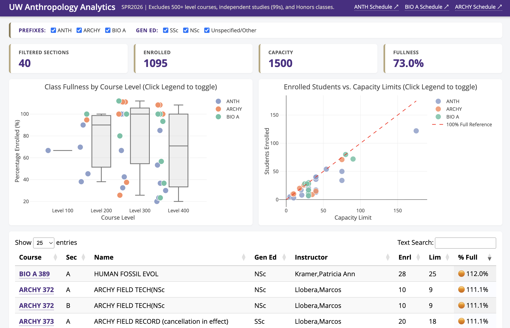
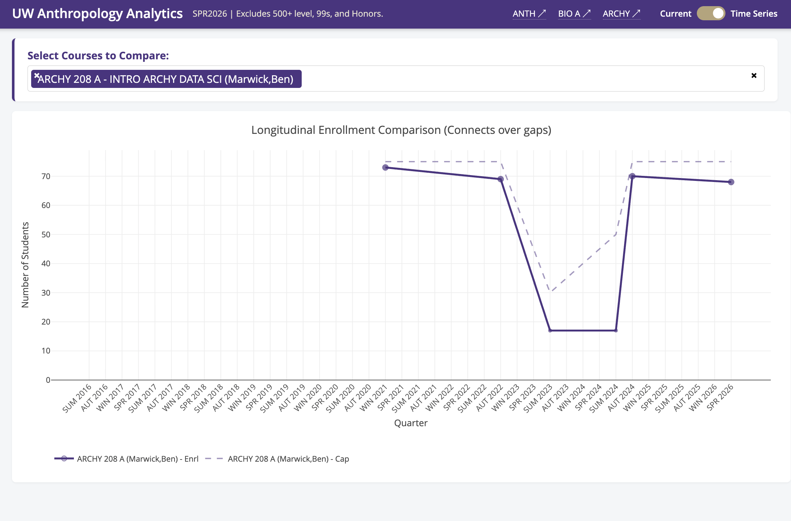
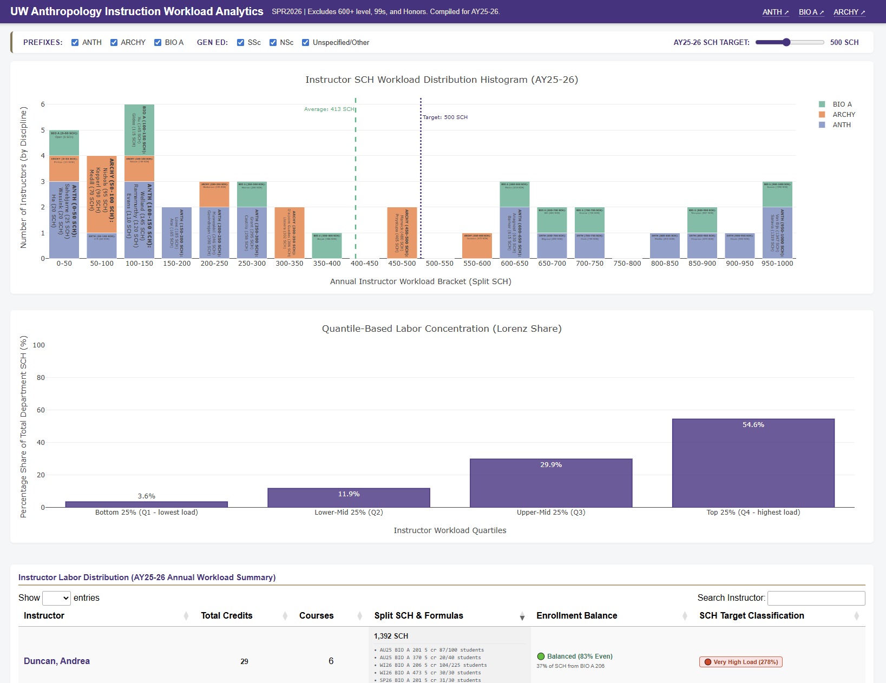

# Web Helpers for UW Administrative Workflows in the [Anthropology Department](https://anthropology.washington.edu/) and [Data Science Minor](https://dataminor.uw.edu/) 

## Introduction

This repository contains scripts, e.g. to create browser bookmarklets or web apps, to help visualize and summarize data and simplify workflows relating to day-to-day operations of the UW Anthropology Department and the Data Science Minor. 

### A Note on Student Privacy and Data Security

**⚠️ Disclaimer & FERPA Warning**: These scripts are unofficial tools created to assist authorized UW faculty/staff workflows. These scripts access FERPA-protected education records. Use is restricted to authorized UW faculty/staff with legitimate educational interest. These scripts are not officially supported or endorsed by the University of Washington or the UW Department of Anthropology. Users of these tools are solely responsible for ensuring compliance with FERPA and [UW Data Security policies](https://it.uw.edu/policies/security-and-privacy-policies/uw-information-security-policies/). Authorised UW faculty/staff will always verify AI-generated outputs against official UW records. AI output is not for official record-keeping; official UW records always take precedence. No automated decisions are made about students using these tools.

**🔒 A Note on Student Privacy and AI**: Because this repository is public, students or parents may be reading this. Please be assured that student privacy is our highest priority:

-   No Public AI: These tools are strictly designed only to be used with UW's enterprise-secured instance of Microsoft Copilot.
-   No AI Training: Under [UW's commercial data protection agreement with Microsoft](https://itconnect.uw.edu/tools-services-support/software-computers/productivity-platforms/microsoft-productivity-platform/microsoft-copilot/), and [Microsoft's data privacy and security policy for Copilot](https://learn.microsoft.com/en-us/copilot/microsoft-365/microsoft-365-copilot-privacy) student data inputted into UW Copilot is never used to train Microsoft's public AI models.
-   Expert, Authorised Human Oversight: Generative AI is used strictly as a summarization and research aide by authorized UW faculty/staff with legitimate educational interests. AI does not make decisions regarding student progress, grades, or degree milestones. All AI-generated summaries are manually reviewed and verified by UW authorised faculty/staff against official university records.

### How to install a bookmarklet:

 A [bookmarklet](https://en.wikipedia.org/wiki/Bookmarklet) is a bookmark stored in your web browser that contains JavaScript commands that make the browser do useful work. These ones only work on sites that require UW credentials to access.

-   Each script must be added to your web browser as a unique bookmark, so repeat these steps for each bookmarklet
-   For Chrome, look on the top menu bar for "Bookmarks", select "Bookmark Manager" 
-   On the very top right of the Bookmarks page, click the three dots to show a drop-down menu, click on "Add new bookmark"
-   For the name field, use 'Time Schedule Viz' or similar for the first bookmarklet (quotes not required)
-   Select all the code in the block under the heading 'Script for the bookmarklet', and paste it into the URL field of the new bookmark box.
-   Click Save to finish making the bookmarklet. Look for the new bookmark in the list of bookmarks top menu bar for "Bookmarks" or on your bookmark bar. 

## Time Schedule Enrollment Dashboard Bookmarklet

#### Overview

For a given quarter, this script collects data from the [UW Time Schedule](https://www.washington.edu/students/timeschd/) pages for any UW course prefix you choose and produces a simple dashboard that visualizes current student enrollment numbers for the selected classes. Type the prefixes you want (one or several, comma-separated, e.g. `ANTH, ARCHY, BIO A`) into the box at the top of the dashboard. The script recognizes all 355 UW course prefixes (e.g. `ANTH`, `ARCHY`, `BIO A`, `CS&SS`, `VIET`); unknown prefixes are rejected with a warning. Each prefix is assigned its own color for the plots and tables. The dashboard includes a switch to a time series view to compare previous quarters of classes to see trends in enrollment, either for a whole course (all lecture sections combined, whoever taught them) or for an individual section and instructor, with checkboxes to include or exclude particular instructors' sections. The script does not use or contain AI and does not use any data other than the Time Schedule pages for the prefixes you select. The script runs entirely in your browser. No data are collected from your computer or stored on your computer. No student-level data or other FERPA-protected data are collected or used by this script.

#### Script for the bookmarklet:

```
javascript:(function(){
  var s = document.createElement('script');
  s.src = 'https://cdn.jsdelivr.net/gh/benmarwick/uw-anthro-web-helpers@main/bookmarklet-time-schedule-viz-generic.js';
  s.onload = function() { console.log('[Bookmarklet] Script loaded'); };
  s.onerror = function() { console.error('[Bookmarklet] Failed to load script'); };
  document.body.appendChild(s);
})();
```

#### How to use:

-   Use your UW credentials to log into the University of Washington Seattle Time Schedule for a given quarter-year, e.g. [https://www.washington.edu/students/timeschd/SPR2026/](https://www.washington.edu/students/timeschd/SPR2026/)
-   Click the 'Time Schedule Viz' bookmark (or whatever you named it when you created it) in your browser and the dashboard will appear in a new tab, it should look similar to the screenshot below.
-   Type the prefixes you want to see (e.g. `ANTH, ARCHY, BIO A`) into the box at the top of the dashboard; each prefix loads its data and is shown as a colored chip that you can remove.
-   Use the Instructors checkboxes below the prefix chips to show or hide the sections taught by particular instructors; the stats, charts, and table update to match.
-   Explore the dashboard by filtering the data using the checkboxes at the top, e.g. click or double-click on the plot legends to show/hide classes; sort the table at the bottom by %Full.
-   Use the checkboxes in the first column of the table to leave individual sections out of the stats and charts; unchecked sections stay in the table, grayed out. The checkbox in the header includes or excludes all listed sections, respecting the Text Search box, and the "Count only" buttons above the table check just one course level (e.g. only 100-level sections) or all levels.
-   In the time series view, choose a course's "(all sections)" entry to see its combined enrollment over the past ten years, or a specific section to follow one instructor's offerings. The Instructors checkboxes there list everyone who taught the selected courses in that period, with the number of sections each taught in parentheses.
-   Close the Dashboard tab when finished. To share the dashboard, print it as a PDF or take a screenshot.

Current quarter view: 



Time series view: 



## Time Schedule Instructor Workload Dashboard Bookmarklet

#### Overview

For a given academic year, this script collects data from the [UW Time Schedule](https://www.washington.edu/students/timeschd/) pages for any UW course prefixes you choose and produces a simple dashboard that visualizes instructor workloads for the instructors of the selected prefixes. Type the prefixes you want (one or several, comma-separated, e.g. `ANTH, ARCHY, BIO A`) into the box at the top of the dashboard. The script recognizes all 355 UW course prefixes and rejects unknown prefixes with a warning. For each selected prefix the script loads the Autumn, Winter, and Spring pages of the academic year and assigns the prefix its own color for the plots and tables. The dashboard calculates annual student credit hours (SCH) for every instructor and visualises the distribution with a histogram and a quantile-based bar plot of labour concentration (so we can see, for example, that 25% of instructors teach 54% of the total SCH). The script generates a Instructor Labor Distribution table with one row for each instructor, and columns to display the total number of courses, credits, SCH, an enrollment balance metric (so we can see if an instructor's SCH are concentrated in only one big course, or evenly disributed accross multiple courses), and a SCH target classification (relative to a target SCH value, this is adjustable with a slider). The script does not use or contain AI and does not use any data other than the Time Schedule pages for the prefixes you select. The script runs entirely in your browser. No data are collected from your computer or stored on your computer. No student-level data or other FERPA-protected data are collected or used by this script.

#### Script for the bookmarklet:

```
javascript:(function(){
  var s = document.createElement('script');
  s.src = 'https://cdn.jsdelivr.net/gh/benmarwick/uw-anthro-web-helpers@main/bookmarklet-time-schedule-workload-generic.js';
  s.onload = function() { console.log('[Bookmarklet] Script loaded'); };
  s.onerror = function() { console.error('[Bookmarklet] Failed to load script'); };
  document.body.appendChild(s);
})();
```

#### How to use:

-   Use your UW credentials to log into the University of Washington Seattle Time Schedule for a given quarter-year, e.g. [https://www.washington.edu/students/timeschd/](https://www.washington.edu/students/timeschd/)
-   Click the 'Time Schedule Workload' bookmark (or whatever you named it when you created it) in your browser and the dashboard will appear in a new tab, it should look similar to the screenshot below.
-   Type the prefixes you want to see (e.g. `ANTH, ARCHY, BIO A`) into the box at the top of the dashboard; each prefix loads its Autumn/Winter/Spring data and is shown as a colored chip that you can remove.
-   Explore the dashboard by filtering the data using the checkboxes at the top, e.g. click or double-click on the plot legends to show/hide classes; sort the table at the bottom by each column.
-   Close the Dashboard tab when finished. To share the dashboard, print it as a PDF or take a screenshot.




## MyGrad Table Audit Bookmarklet

#### Overview

For the [Current Student List](https://webappssecure.grad.uw.edu/mgp-dept.stu.detail/home/studentlist?orgid=14) view of MyGrad, this script modifies the table rows to indicate years since admission to the program, and whether or not a student has an advisor. It includes a filter to show only those students that have been in their graduate program 6-8-10 or more years. The script will work on any UW graduate program that uses MyGrad. The script does not collect or use any information about the student outside of MyGrad. The script does not use or contain AI. The data collected by the script are protected by the Family Educational Rights and Privacy Act ([FERPA](https://registrar.washington.edu/staff-faculty/ferpa/)) of 1974 and must not be shared outside of the UW Anthropology advising office without written consent of the student. No data are collected from your computer. 

#### Script for the bookmarklet:

```
javascript:(function(){
  var s = document.createElement('script');
  s.src = 'https://cdn.jsdelivr.net/gh/benmarwick/uw-anthro-web-helpers@main/bookmarklet-mygrad-table-audit.js';
  s.onload = function() { console.log('[Bookmarklet] Script loaded'); };
  s.onerror = function() { console.error('[Bookmarklet] Failed to load script'); };
  document.body.appendChild(s);
})();
```

#### How to use:

-   Using your official UW-issued computer, use your UW credentials to log in to [MyGrad Department View](https://facstaff.grad.uw.edu/mygrad-for-faculty-and-staff/#mygrad-faculty-staff-2). These are FERPA-protected education records and this view is only available to authorized faculty and staff in GPC/GPA roles.
-   Navigate to the [Current Student List](https://webappssecure.grad.uw.edu/mgp-dept.stu.detail/home/studentlist)
-   Click the 'MyGrad Table Audit' bookmark (or whatever you named it when you created it) in your browser 
-   Scroll down the page to inspect the table with the new modifications that highlight years in the program and absence of an advisor for each student. 


## MyGrad Anthropology Department Student Summary Bookmarklet

#### Overview

For a given graduate student, this script collects data from [MyGrad's](https://facstaff.grad.uw.edu/mygrad-for-faculty-and-staff/) Student Detail page, the Transcripts page, the Advisors / Committees page, and the Doctoral Exam Requests page. It structures the data as a single, compact JSON object and pastes the data into your computer's clipboard. The pasted data are prefixed by plain text instructions specifically for use with UW's [Microsoft Copilot with commercial data protection](https://itconnect.uw.edu/tools-services-support/software-computers/productivity-platforms/microsoft-productivity-platform/microsoft-copilot/). These instructions tell Copilot to review the relevant UW Anthropology graduate program (e.g. [Sociocultural Anthropology](https://anthropology.washington.edu/phd-anthropology-sociocultural-anthropology), [Archaeology](https://anthropology.washington.edu/phd-anthropology-archaeology) and [Biological Anthropology](https://anthropology.washington.edu/phd-anthropology-biological-anthropology) and [UW Graduate School web pages](https://grad.uw.edu/policy_audience/doctoral-students/). Copilot will compare the student's data on MyGrad with the published program requirements and summarize findings in a structured summary report. Copilot will return a table indicating the student's progress relative to key milestones of the student's specific Doctoral program, a table of potential administrative issues, a narrative of the student's current administrative status and recommended next steps to advance to the next program requirement. The report is strictly limited to the requirements documented in the department's program website, the UW Graduate School policies, and the student's record in MyGrad. With minor modifications the script could make similar summaries for any UW graduate program. The script does not collect or use any information about the student outside of MyGrad. The script does not use or contain AI and does not interact directly with Copilot, this is left to you. The data collected by the script are protected by the Family Educational Rights and Privacy Act ([FERPA](https://registrar.washington.edu/staff-faculty/ferpa/)) of 1974 and must not be shared outside of the UW Anthropology advising office without written consent of the student. No data are collected from your computer. 

#### Script for the bookmarklet:

```
javascript:(function(){
  var s = document.createElement('script');
  s.src = 'https://cdn.jsdelivr.net/gh/benmarwick/uw-anthro-web-helpers@main/bookmarklet-mygrad-student-summary.js';
  s.onload = function() { console.log('[Bookmarklet] Script loaded'); };
  s.onerror = function() { console.error('[Bookmarklet] Failed to load script'); };
  document.body.appendChild(s);
})();
```

#### How to use:

-   Using your official UW-issued computer, use your UW credentials to log in to [MyGrad Department View](https://facstaff.grad.uw.edu/mygrad-for-faculty-and-staff/#mygrad-faculty-staff-2). These are FERPA-protected education records and this view is only available to authorized faculty and staff in GPC/GPA roles.
-   Navigate to the [Current Student List](https://webappssecure.grad.uw.edu/mgp-dept.stu.detail/home/studentlist)
-   Click on a student's name to go the Student Detail page for that student
-   Click the 'MyGrad Student Summary' bookmark (or whatever you named it when you created it) in your browser and look for a new button to appear at the top center of the Student Detail web page
-   Click the new button and wait for it to turn green to indicate that the script has finished working. Do not leave the page until the script has finished or it will fail (click it again to retry). When the button is green, you computer's clipboard is loaded with text ready for the next steps
-   Go to https://copilot.microsoft.com/ and log in with your UW Net ID to ensure your data are not shared outside of UW, and start a New Chat
-   In the lower left of the chat box, change "Smart" to "Think deeper", this is essential to get a high-quality report
-   Click in the chat box and paste in the data from MyGrad. It may show as plain text or a single file attachement, either are ok. Press enter to submit the chat
-   Wait for Copilot to reply and review the report. Do not save, screenshot, or copy-paste the report out of Copilot
-   You must manually verify the AI's report against the student's official MyGrad record before taking any advising action or corresponding with the student or their faculty advisor. This is important because Copilot may occasionally hallucinate or misinterpret policies or misread the student's data.
-   Immediately delete the chat from Copilot after reviewing the report. Immediately copy to your clipboard a random word from this website to replace the student data and ensure you do not accidentally paste the student's FERPA-protected JSON data elsewhere.

## EARS Data Science Minor Bookmarklet

#### Overview

For a undergraduate student in the Data Science Minor, this script collects data from [EARS](https://registrar.washington.edu/staff-faculty/ears/) to help with managing the Minor's [overlap restriction](https://dataminor.uw.edu/curriculum/overlap/) and assigning classes taken by a student to fulfil the Minor's requirements. The script collects data from the student's degree audits and identifies if there are more than ten credits overlap between the Data Science Minor and the 'Departmental Requirements' or 'Admissions Requirements' section of their major degree audit. The script identifies if there are credits needed to meet the 25 credit minimum, and identifies if courses the student has already taken can by applied to the Minor. The script bundles the audit data and puts it on your clipboard ready to paste into Copilot for verification. If the student has more than 10 credits of overlap, the script prompts Copilot to suggest possible course substitutions from the list of courses taken by the student but that are not currently assigned to a requirement. The script prompts Copilot to suggest courses taken by the student that could be applied to the 25 credit requirement, if that requirement has not been fulfilled. The script does not collect or use any information about the student outside of EARS. With minor modifications the script could do similar overlap analysis for other UW undergraduate programs. The script does not use or contain AI and does not interact directly with Copilot, this is left to you. The data collected by the script are protected by the Family Educational Rights and Privacy Act ([FERPA](https://registrar.washington.edu/staff-faculty/ferpa/)) of 1974 and must not be shared outside of the UW Undergraduate Academic Advising office without written consent of the student. No data are collected from your computer.

#### Script for the bookmarklet:

```
javascript:(function(){
  var s = document.createElement('script');
  s.src = 'https://cdn.jsdelivr.net/gh/benmarwick/uw-anthro-web-helpers@main/bookmarklet-ears-dsm-overlap.js';
  s.onload = function() { console.log('[Bookmarklet] Script loaded'); };
  s.onerror = function() { console.error('[Bookmarklet] Failed to load script'); };
  document.body.appendChild(s);
})();
```

#### How to use:

-   Using your official UW-issued computer, use your UW credentials to log in to [EARS](https://sdb.admin.uw.edu/sisAdvising/securid/dars.aspx). These are FERPA-protected education records and this view is only available to authorized faculty and staff in advising roles.
-   Enter the student number to access their record, click on the 'Degree Audit' tab
-   Create and submit (or resubmit) audits for both their Major(s) and the Data Science Minor
-   Wait for the 'Available Audits' table to show 'Detail' links in the 'Detail' column for both the Major(s) and the Data Science Minor
-   Click the 'EARS DSM overlap' bookmark (or whatever you named it when you created it) in your browser. Do not leave the page until the script has finished or it will fail (click it again to retry). When the script has finished running, a message will pop up to let you know. This pop-up includes a summary of the overlap situation for this student. At this point your computer's clipboard is loaded with text ready for the next steps
-   Go to https://copilot.microsoft.com/ and log in with your UW Net ID to ensure your data are not shared outside of UW, and start a New Chat
-   In the lower left of the chat box, change "Smart" to "Think deeper", this is essential to get a high-quality report
-   Click in the chat box and paste in the data from EARS. It may show as plain text or a single file attachement, either are ok. Press enter to submit the chat
-   Wait for Copilot to reply and review the report. Do not save, screenshot, or copy-paste the report out of Copilot
-   You must manually verify the AI's report against the student's official EARS record before taking any advising action or corresponding with the student. This is important because Copilot may occasionally hallucinate or misinterpret policies or misread the student's data.
-   Immediately delete the chat from Copilot after reviewing the report. Immediately copy to your clipboard a random word from this website to replace the student data and ensure you do not accidentally paste the student's FERPA-protected JSON data elsewhere.

## TA Allocation Google Apps Script

#### Overview

This script is for the [Apps Script extension](https://script.google.com/u/2/home/projects/1JbpEoRzFEPgIgiQYu_LC9fyc2_siE0_Hj3pXuzPh1PEEg4wngowhXYKC/edit) of the Google Sheet that has the [responses](https://docs.google.com/spreadsheets/d/1AciklpugU7b5dmF8QMEo0oQBhXkEVpzGwO5oWJQ8qlw/edit?resourcekey=&gid=1270289789#gid=1270289789) to the [TA application form](https://docs.google.com/forms/d/1mxCN2SqQHeep9nvWni1c53RTk5T2PPJhL2VrZJU4_cY/edit). The script uses the TA requests entered by faculty in the three sub-disciplines' planning sheets ([ANTH](https://docs.google.com/spreadsheets/d/1LEg20-MM1noo5Kq6W4MYFe4IUObB5ZveDj8uGZ75fPE/edit?gid=57332291#gid=57332291), [ARCHY](https://docs.google.com/spreadsheets/d/1qu6Dl1ua2dLnkeR-j3ek1OJWAEVATlIdSJzjpH8CoAQ/edit?gid=907170236#gid=907170236), [BIO A](https://docs.google.com/spreadsheets/d/15UlwHFfsHngtT5VXnyLs6EinHqBtWuyOphy5ZaHLmXo/edit?gid=250576250#gid=250576250)), these are automatically aggregated on the [Anthropology curriculum forecast sheet](https://docs.google.com/spreadsheets/d/1KTLT-PZzRjaZYCOdWGMEfAcZwEjby1mhXWoJMnUF8E0/edit?gid=1652963397#gid=1652963397). The script takes this agregation of TA requests from faculty, the form responses from student applicants, and applies the eligibility and ranking criteria of the [Anthropology Department's ASE Appointment Policy Document](https://uwnetid.sharepoint.com/:w:/s/anthropology/IQCSL8eTPICOQpJnJDdLKhYIAddRn-8w1dv9tuAR5907A74?e=YOAAOv) to allocate applicants to the TA positions requested by faculty. In brief, it matches students with the classes they are eligible to TA for, then within those groups, applies multiple passes of rankings based on guaranteed funding status, numbers of prior TA positions, progress in their program, and evidence of readiness to TA. The script produces a sheet showing all applicants eligible for each course, and their rankings, with columns detailing the evidence for the ranking. It also generates an allocation summary sheet that shows how the department's obligations to students with guaranteed funding can be met by TA placements. This sheet shows an overview of the TA placements for all students with guaranteed funding, detailing the courses they best meet the eligibilty criteria for. It also identifies any unplaced students to assist with manual review. The script has several elements that are hard-coded for the 2026-27 application cycle, these will need to be updated for future years. The script does not collect or use any information about the student outside of their response to the TA application form. The script does not use or contain AI. The data collected by the script are protected by the Family Educational Rights and Privacy Act ([FERPA](https://registrar.washington.edu/staff-faculty/ferpa/)) of 1974 and must not be shared outside of the UW Anthropology Department without written consent of the student. No data are collected from your computer.  

#### Script for the App

[google-apps-ta-allocation-workflow.gs](https://github.com/benmarwick/uw-anthro-web-helpers/blob/main/google-apps-ta-allocation-workflow.gs)

#### How to use:

- Review the data entered into the three sub-disciplines' planning sheets ([ANTH](https://docs.google.com/spreadsheets/d/1LEg20-MM1noo5Kq6W4MYFe4IUObB5ZveDj8uGZ75fPE/edit?gid=57332291#gid=57332291), [ARCHY](https://docs.google.com/spreadsheets/d/1qu6Dl1ua2dLnkeR-j3ek1OJWAEVATlIdSJzjpH8CoAQ/edit?gid=907170236#gid=907170236), [BIO A](https://docs.google.com/spreadsheets/d/15UlwHFfsHngtT5VXnyLs6EinHqBtWuyOphy5ZaHLmXo/edit?gid=250576250#gid=250576250)). In particular, ensure that the column for # TAs does not have non-numeric content, the script will not handle this. Look to see that all courses have a prefix (ANTH/ARCHY/BIO A) and course number (exactly three digits, nothing else), if any of these are missing or in an unusual format, the script will not include them.
- Review the automatic aggregation of the TA requests on the [Anthropology curriculum forecast sheet](https://docs.google.com/spreadsheets/d/1KTLT-PZzRjaZYCOdWGMEfAcZwEjby1mhXWoJMnUF8E0/edit?gid=1652963397#gid=1652963397) to ensure that all the requests on the sub-disciplines' planning sheets have accurately been captured.
- Open the [Apps Script extension](https://script.google.com/u/2/home/projects/1JbpEoRzFEPgIgiQYu_LC9fyc2_siE0_Hj3pXuzPh1PEEg4wngowhXYKC/edit) of the Google Sheet that has the [responses](https://docs.google.com/spreadsheets/d/1AciklpugU7b5dmF8QMEo0oQBhXkEVpzGwO5oWJQ8qlw/edit?resourcekey=&gid=1270289789#gid=1270289789) to the [TA application form](https://docs.google.com/forms/d/1mxCN2SqQHeep9nvWni1c53RTk5T2PPJhL2VrZJU4_cY/edit).
- In the Code.gs editor, paste in the script and click the save icon.
- Switch to the Google Sheet that has the [responses](https://docs.google.com/spreadsheets/d/1AciklpugU7b5dmF8QMEo0oQBhXkEVpzGwO5oWJQ8qlw/edit?resourcekey=&gid=1270289789#gid=1270289789), look at the menu at the top of the page for a new item called "TA Allocation", click on it and select the first item "1. Extract Evaluation Scores", these are only used for breaking rare ties at the end of the filtering and sorting steps. Wait a few moments for the script to run. 
-  Click a second time on "TA Allocation", click on it and select the second item "2. Run Ranking Workflow". Wait a moment for the script to run, a message will pop up indicating success, and two new tabs will be present in the sheet: Ranked_Applicants and Allocation_Summary
- Review the results in the new sheets to identify who to offer which TA position, and make manual adjustments as necessary 

## TA Evaluation System Google Apps Script

#### Overview

This app provides an online workflow the department's "[Academic Student Employee (ASE) Evaluation Form](ta-evaluation-workflow/examples/Academic%20Student%20Employee%20(ASE)%20Evaluation%20Form.pdf)". For each ASE (e.g. a teaching assistant), the app manages the evaluation workflow: the instructor rates the ASE's job duties and signs the evaluation, the ASE reviews the feedback and adds a self-evaluation, and the instructor reviews the ASE's self-evaluation and gives a final sign-off. The completed evaluation is rendered as a signed PDF that is emailed to both parties and archived in Google Drive. Each step is securely reached by the professor or the ASE through a unique, time-limited link emailed to them, and every transition is recorded in an audit log. The app runs entirely within UW's Google Workspace and does not use or contain AI. No data are collected from anyone's computers.

#### Scripts for the App

[ta-evaluation-workflow/](https://github.com/benmarwick/uw-anthro-web-helpers/tree/main/ta-evaluation-workflow), with full documentation in its [README](https://github.com/benmarwick/uw-anthro-web-helpers/blob/main/ta-evaluation-workflow/README.md)

#### How to use:

-   The app is deployed as a [Google Apps Script web app](https://script.google.com/macros/s/AKfycbyseoid07zdu5E6YmHy3S9of35FlhQn1PqjPBYUqIcVKakjVLyk_Lp1vaDMIthssQXNMg/exec) with its master [spreadsheet](https://docs.google.com/spreadsheets/d/1hCvDujkSyjmbtH9ZOyntV6Va1c8ye7Hxt0RbSOFIxDc/edit). Set the coordinator email, archive Drive folder, and app URL in `Config.gs`.
-   Open the [Apps Script project](https://script.google.com/home/projects/17tiixPCukHffnZMe8Ph48qL1Y8x7Lz3pmeX4IgHK_TV3Vd--Kjb5qrTU), push the code with [clasp](https://developers.google.com/apps-script/guides/clasp) (`clasp push`), and deploy it as a Web App.
-   In the master spreadsheet, use the **TA Evaluation System** menu to run *Initialize Sheets*, select the `NOT_STARTED` rows, and run *Launch Selected Evaluation(s)* to email the instructor their evaluation link.
-   The instructor completes and signs the evaluation, the ASE adds a self-evaluation, and the instructor reviews this self-evaluation and gives a final sign-off — each step is emailed to the next party as a new tokenized link.
-   The completed evaluation is rendered as a signed PDF, emailed to both the instructor and the ASE, and archived in Google Drive. Every step is written to the audit log.

### License

Copyright 2026 [Ben Marwick](https://faculty.washington.edu/bmarwick/)

Permission is hereby granted, free of charge, to any person obtaining a copy of this software and associated documentation files (the “Software”), to deal in the Software without restriction, including without limitation the rights to use, copy, modify, merge, publish, distribute, sublicense, and/or sell copies of the Software, and to permit persons to whom the Software is furnished to do so, subject to the following conditions:

The above copyright notice and this permission notice shall be included in all copies or substantial portions of the Software.

THE SOFTWARE IS PROVIDED “AS IS”, WITHOUT WARRANTY OF ANY KIND, EXPRESS OR IMPLIED, INCLUDING BUT NOT LIMITED TO THE WARRANTIES OF MERCHANTABILITY, FITNESS FOR A PARTICULAR PURPOSE AND NONINFRINGEMENT. IN NO EVENT SHALL THE AUTHORS OR COPYRIGHT HOLDERS BE LIABLE FOR ANY CLAIM, DAMAGES OR OTHER LIABILITY, WHETHER IN AN ACTION OF CONTRACT, TORT OR OTHERWISE, ARISING FROM, OUT OF OR IN CONNECTION WITH THE SOFTWARE OR THE USE OR OTHER DEALINGS IN THE SOFTWARE.

### Acknowledgments

The code in this repository was developed and tested with assistance from generative AI tools, including Mimo Pro 2.5, DeepSeek V4, Qwen 3.7-Plus, ChatGPT 5.2, Claude Sonnet 5, and Gemini 3.1 Pro. I used [Purple](https://purple.uw.edu/), [OpenCode](https://opencode.ai/) and [OpenRouter](https://openrouter.ai/).   
